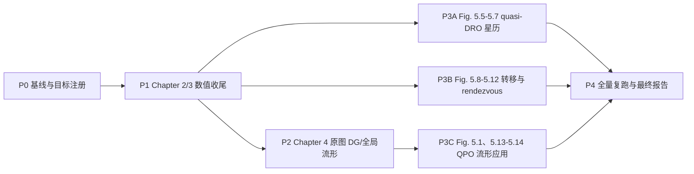

# McCarthy 2018 后续复现执行计划

更新时间：2026-07-11  
适用项目：`mccarthy2018_reproduction`  
计划性质：目标模式的执行与验收基线

## 1. 目标模式目标

在保护当前工作树和保持 54/54 图可生成的前提下，将 McCarthy 2018 复现从“工程覆盖 + source-layer 审计”推进为“逐图可审计的论文级复现”。最终必须同时具备可重复运行的代码、论文参数注册表、CSV/NPZ 数值证据、独立复核、PNG/PDF 图件和限制说明；不得把 rejected/diagnostic 行、digitized trend、grey proxy 或派生 Route H 图误报为原论文数值结果。

目标保持 active，只有第 9 节的总验收门槛全部通过后才可标记完成。

## 2. 当前基线与真实完成度

本计划基于 2026-07-11 当前工作树，而不是 `main` 的干净快照。工作树中已有大量未提交实验改动，执行阶段必须先保存状态，不得覆盖或回滚用户工作。

- 论文范围：Chapter 2 Fig. 2.1-2.15、Chapter 3 Fig. 3.1-3.17、Chapter 4 Fig. 4.1-4.8、Chapter 5 Fig. 5.1-5.14，共 54 图。
- 图件覆盖：54/54 张目标 PNG 已存在；当前工程覆盖完整。
- 语义示意图：13 张，可按 V0/语义正确验收，不要求构造不存在的数值解。
- 数值或应用图：41 张，其中 16 张当前为 `numerical reproduction`，25 张仍是 baseline、source-layer、local overlay 或 partial。
- 当前 25 张待升级图：Fig. 2.13；Fig. 3.9、3.10、3.11、3.16、3.17；Fig. 4.1-4.8；Fig. 5.1、5.5-5.14。
- Route H：30 个导出验证成员，最大 `|z| = 14573.10318409037 km`，30 行超过 10,500 km，29 行超过 11,000 km；最大 map residual 为 `6.469474407020314e-10`。
- Route H 的边界：当前导出成员的平均 Jacobi 范围仅为约 `2.9220593262..2.9222548409`，尚未覆盖 Fig. 3.16 标注的完整目标 `2.9225、2.9221、2.9215、2.9212`。因此“振幅 source gate 通过”不能替代“论文参数范围复现”。
- Chapter 4：Route H 派生 DG/manifold source-layer 已通过，但原论文 Fig. 4.1-4.8 全部仍是 partial；派生 quasi-DRO 图不能替代 L1 quasi-halo/quasi-vertical 原图。
- Chapter 5：aggregate readiness/source-layer gate 已通过，但各原图仍包含 CR3BP baseline、DE421 geometry、短段 BCR4BP correction 或 proxy；这些结果不能自动升级为原论文应用图等价复现。
- Chapter 4 科学风险已显式化：`real_hyperbolic_eigen_index()` 的近实硬门槛和 staged gate 已修复；全 31-member 扫描只有 member 68 通过，旧 Chapter 4 aggregate pass 已撤销，必须重建具有分支覆盖的真实双曲 source family。
- Route H 可复现性边界：旧 monolithic full cold-start 两次均在 `JC=2.9222828` 失去自然参数单调方向，只得到 19-member checkpoint；该失败继续保留为负证据。当前 hybrid cold-start 已把零缓存 checkpoint 接入 fixed-Jacobi free-time bridge、逐点能量固定时间同伦和 `N=57→69→81→93→105` 谱提升，Fig. 3.16 四个 Jacobi 锚点达到论文报告精度 `4/4`（内部严格固定时间 `3/4`），权威状态已推进为 `chapter3_passed_chapter4_ready`。
- Chapter 5 尺度风险：现有 BCR4BP correction/optimization 主要是约 `0.13..0.30 day` 的短段 source-layer，不是原论文的长期场景或具体转移。
- 验证基础设施：当前没有独立 `tests/`、CI 或依赖锁；`pyproject.toml` 还缺少代码实际使用的 `skyfield` 声明。`scripts/validate_basics.py` 是重型、会写产物的集成脚本，最近完整日志早于 Route H 和 7 月 8-9 日的更新。

当前权威事实源依次为：

1. `data/computed/figure_validation_table.csv`
2. `data/computed/mccarthy2018_staged_goal_gate_status.csv`
3. `docs/mccarthy2018_staged_goal_gate_status.md`
4. `docs/continuation_reproduction_prep.md`
5. Chapter 4/5 的 per-figure audit CSV 与 Markdown

`docs/project_index.md`、`docs/stage_report_reproduction_status.md`、`docs/next_reproduction_roadmap.md` 中仍有旧的 10,164 km/partial 口径，执行时不能把这些旧文字当作当前事实。

## 3. 统一复现等级

沿用并收紧原计划的三级验收：

- V0 视觉/语义复现：布局、坐标、对象和物理含义正确。仅适用于 13 张纯示意图。
- V1 物理复现：动力学模型、轨道类型、坐标系、单位、时间、Jacobi/频率/稳定性趋势和约束语义与论文一致。
- V2 数值复现：论文明确标注的参数、曲线、事件和任务指标在登记容差内复现，并有独立复核证据。

最终目标不是逐像素复制，而是：13 张纯示意图达到 V0，41 张数值或应用图全部达到 V1，且所有有明确数值、可数字化曲线或可计算事件的图达到 V2。`uses_proxy` 可以用于灰色参考对照，但不得作为主 numerical source。

## 4. 统一证据与门槛

### 4.1 论文目标注册表

先建立 `data/reproduction_targets.csv`，每个目标字段至少包含：

- `figure_id`、PDF 页码、论文图号和章节；
- 动力学模型、坐标系、归一化、单位和状态顺序；
- 参数名、目标值/区间、容差和容差理由；
- `source_type = explicit | derived | digitized | assumption`；
- 论文原文位置或数字化元数据；
- 对应生成脚本、证据文件和审计 gate。

公共积分器和默认门槛放入 `config.yaml`；逐图论文目标放入注册表。论文未给出的值不得伪造，必须标为 assumption，并单独做敏感性分析。

### 4.2 建议数值门槛

以下为默认门槛；若某图需不同门槛，必须在目标注册表中记录原因。

| 对象 | 默认验收 |
| --- | --- |
| 周期轨道 | 全周期状态闭合误差 `<= 1e-8`（归一化）；Jacobi 漂移 `<= 1e-10` |
| 不变曲线/环面 | map residual、phase residual、曲线 Jacobi span 均 `<= 1e-9`；独立一映射和十返回复核通过 |
| period-q | patch continuity `<= 1e-10`；full-period closure `<= 1e-8`，或经明确批准的高精度分段等价审计 |
| DG/特征结构 | eigenpair residual 与 symplectic/determinant error `<= 1e-8`；双曲方向需通过显式近实阈值和 reciprocal-pair 检查；加密离散后关键指标相对变化 `<= 1e-3` |
| CR3BP 流形 | Jacobi 漂移 `<= 1e-10`；论文快照时刻、方向和全局空间范围均被覆盖 |
| 多段打靶/星历修正 | 归一化连续性 `<= 1e-9`；CR3BP/短段端点默认 `<= 1e-3 km`，长期星历段端点 `<= 1 km` 且速度缺陷 `<= 1 mm/s`；坐标往返和历元一致性通过 |
| 论文标量 | 误差不大于论文舍入/数字化不确定度；无不确定度时默认相对误差 `<= 2%`，任务 `delta-v` 默认 `<= 5%` |
| 数字化曲线 | 主区间覆盖 `>= 90%`；误差落入数字化不确定度，并保留原始像素标定 |

所有新结果必须区分 `trial`、`diagnostic`、`accepted`、`independently_revalidated`。只有最后两类可以升级原图。

### 4.3 每次升级的交付合同

每张图或每个家族升级必须同时提交：

1. 可重复入口脚本；
2. 显式配置/参数来源；
3. CSV 或 NPZ 数值结果；
4. Markdown 审计；
5. PNG 和 PDF；
6. 独立复核结果；
7. `figure_validation_table.csv` 的生成式更新，而不是手工改结论。

## 5. 依赖关系与关键路径

Route A 原始数据搜索可以并行，但不是阻塞全部数值工作的理由。若原始 branch data 继续不可得，使用论文明确值与带不确定度的 digitization 验收，并在最终报告中保留不可证明的边界。

## 6. 分阶段执行计划

### P0：冻结基线、统一事实源和建立测试分层（建议 1 周）

任务：

1. 保存当前 `git status`、diff 清单、环境版本和关键产物哈希；不清理、不回滚现有工作树。
2. 建立 54 图论文目标注册表，并把 13 张示意图与 41 张数值图显式分开。
3. 让 README、project index、stage report、roadmap、teacher package 全部由同一组 CSV 事实源同步，清除当前口径冲突。
4. 把验证拆成只读 smoke、逐章 audit、长时间 full 三层；给重型脚本增加独立输出目录或 dry-run 约束。
5. 增加最小回归：CR3BP 不变量、CSV schema/唯一性、gate 枚举、54 图存在性和关键 Route H 指标。
6. 在空缓存或隔离缓存目录中重建一次 Route H 输入，证明固定 hash 的 pickle 不是唯一不可再生来源，并记录缓存参数、代码版本和哈希。
7. 补齐环境依赖声明/锁定，并为 Chapter 4 增加特征值近实性、eigenpair residual、reciprocal pair 和 growth-direction gate；先把当前复特征值误选暴露为失败测试。

退出门槛：

- 54 个 figure target 唯一且可追溯；
- 13/41 分类固定，当前 16/25 状态可由脚本重算；
- 所有公开状态文档与 staged gate 一致；
- smoke 测试在显式 `cislunar` 解释器下通过；
- Route H 至少完成一次 cold-start 或隔离缓存重建与独立审计。
- Chapter 4 的复特征值误选测试先失败、修正后通过；旧 aggregate pass 已按新 gate 重算。

### P1：Chapter 2/3 数值收尾（建议 2-4 周）

优先顺序：

1. Fig. 3.16/3.17：把固定映射时间分支从“高振幅 source-layer”升级为“论文参数范围”。必须覆盖或可靠插值到 `JC = 2.9225、2.9221、2.9215、2.9212`，保持 `T0 = 14.74/14.75 days` 的论文舍入语义，并给出完整 rho-amplitude-JC 趋势。当前 Route H 只覆盖约 `JC=2.922059..2.922255`、`rho=1.44586..1.45717`，而论文数字化曲线约覆盖 `rho=1.436..1.510`；在重叠的 `rho=1.450/1.455` 附近，当前 `z` 振幅比论文数字化趋势低约 3,701/4,073 km。需要改变 continuation/branch-following 策略，而不是只扩大同一局部重试。
2. Fig. 3.9：继续 constant-energy quasi-halo 尾段，移除 dashed proxy，并对 mapping time-frequency ratio 全区间做残差与趋势审计。
3. Fig. 3.11：在 `JC = 3.1389` 下生成足够密集的 Poincare section 和中心周期轨道/岛结构，替换当前局部形状假设。
4. Fig. 3.10：对 q=8 使用高精度、多段/多精度复核，解决高不稳定性下的 full-period closure；q=2/q=3 保持现有严格行不退化。
5. Fig. 2.13：补足 Jupiter-Europa L2 Lyapunov/halo/vertical 家族的论文幅值范围和分支对照。

退出门槛：

- 以上 6 张图不再是 baseline/source-layer/partial；
- Fig. 3.16 四个论文 Jacobi anchor 均有 accepted + independent revalidation；
- Fig. 3.17 主曲线不依赖 grey/digitized trend 作为 numerical source，且重叠区与当前数字化参考的误差进入约 `±600 km`、`±1e-5 JC` 的标定不确定度；
- P1 所有关键环面满足第 4.2 节默认门槛，并通过分辨率加密复核。

### P2：Chapter 4 原论文 DG 与全局流形替换（建议 3-5 周）

任务：

1. Fig. 4.1：在论文指定的 Earth-Moon L2 quasi-halo、`JC = 3.044`、`N = 25` 语义下计算离散曲线 DG 与完整特征结构；当前实现实际使用 `N=15`，且现有稳定指标约 `1337`，与论文约 `1.3837` 不同，必须先排除特征值选择/缩放错误，并把 `nu=1.3837` 复现到至少 3-4 位有效数字。
2. Fig. 4.2：沿 `JC = 3.1389` L1 constant-energy quasi-halo 家族计算稳定性指标，覆盖论文曲线范围并与关联周期 halo 点一致；当前局部指标约为 `619`，必须先解释其与论文稳定性定义/尺度的差异。
3. Fig. 4.3/4.4：从 continued L1 quasi-halo 家族生成 `+x/-x` 全局不稳定流形，复现 7.79、9.75、11.39、13.02 天快照。
4. Fig. 4.5/4.6：从 continued quasi-vertical 家族生成 `+x/-x` 全局不稳定流形，复现 8.05、10.08、11.77、13.46 天快照。
5. Fig. 4.7/4.8：用完整 quasi-periodic source family 的全局流形与周期 halo 流形做同一坐标/相位对照，移除 grey proxy 主层。
6. 对 DG 同时做 STM/插值实现、有限差分抽查、谱分辨率加密和正负方向传播一致性审计。

退出门槛：

- 原始 Fig. 4.1-4.8 每张都有 corrected source，而不是只引用派生 `fig_4_route_h`；
- 8 张图 `uses_proxy=false`（参考对照层除外）；
- DG、特征值、流形 Jacobi 漂移和快照时刻全部通过第 4.2 节门槛；
- 全局 sheet 覆盖论文尺度，local probe 不得冒充 global replacement。

### P3：Chapter 5 逐图高保真/优化复现（建议 4-8 周）

#### P3A：长期 QPO 与 quasi-DRO 星历场景

- Fig. 5.1：用 corrected two-frequency Sun-Earth L1 quasi-vertical/Lissajous 轨道完成 325、1,068、2,182 天传播；当前 72.5 天 center-mode baseline 不足。
- Fig. 5.5：用 accepted fixed-time quasi-DRO 完成 10 返回、147.5 天 CR3BP 轨迹；平面 DRO 应复现约 `2.3 h/rev` 的视线中断，quasi-DRO 应实现全程零中断，并验证月影几何。
- Fig. 5.6/5.7：从 Route H 初猜出发，在 Sun-Earth-Moon ephemeris 或明确 BCR4BP 模型中完成真正的 defect correction；Fig. 5.6 在 2020-06-15 复现 `0/24/80/120 deg` 插入相位，Fig. 5.7 在固定相位下复现 2020-06-01/04/10/15 四个历元，不能只做 DE421 坐标嵌入。

#### P3B：Earth-Moon 转移与 rendezvous

- Fig. 5.8：复现 186.9 天 halo-to-Lyapunov 转移，论文目标为 `139.4 + 4.0 = 143.4 m/s`；两次燃烧分别控制在 `1 m/s` 或 `1%` 内，TOF 误差 `<=0.1 day`。当前约 `294.6245 m/s` CR3BP 行和 `0.137 m/s` 短段派生优化都不能替代该原图任务。
- Fig. 5.9：构造 corrected quasi-NRHO torus/corridor，保留 `rp = 4,800/12,610 km` 的周期边界和交点事件；稳定指标目标为约 `1.5425/1.1762`，误差不超过 `1e-3`。
- Fig. 5.10/5.11：逐图复现方案 1 的 `48.3+32.2=80.5 m/s、23 day` 与方案 2 的 `51.3+35.3=86.6 m/s、12.4 day`，并验证反向对称/高保真等价；每次燃烧分别控制在 `1 m/s` 或 `1%` 内。当前 23 天 `47.734 m/s` 结果与论文指标不一致，12.4 天仅总量接近、燃烧分配仍不匹配。
- Fig. 5.12：以论文 Fig. 5.10 方案 1 的 `80.5 m/s` 为基线，把到达时移分支从当前 `-24..+11 h` 扩展到论文 `+/-1 day`，复现约 `-6.5 h` 的最小值并越过现有 fold；当前约 `+6 h` 的最小值方向相反，不能只做平移解释。

#### P3C：Sun-Earth 稳定流形接入

- Fig. 5.13：构造论文量级 `z≈940,000 km、y≈660,000 km` 的 two-angle quasi-periodic torus，用不少于 3,500 个环面点做稠密稳定流形扫描，生成真实 periapsis heat map，并恢复约 7,033 km 的候选近地点。
- Fig. 5.14：从 Fig. 5.13 已验收的二维环面流形出发，完成 185 km LEO（地心半径约 `6,563 km`）端点匹配与高保真/历元复核；除 LEO 出发外应保持零确定性插入机动。当前 periodic-orbit baseline 仅作为初猜。

退出门槛：

- 11 张非示意 Chapter 5 原图逐图拥有匹配的模型、端点、约束、目标函数、历元和任务指标；
- source-layer 派生图保留为诊断，不计作原图替换；
- 所有论文明确 `delta-v`、TOF、历元、相位和半径目标在注册容差内；
- 长期轨道和转移均有独立重积分/网格加密或不同初值复核。

### P4：全量冷启动复跑、视觉对照和最终报告（建议 1-2 周）

任务：

1. 在隔离输出/缓存目录执行一次 cold-start 全流程；再执行一次独立复核，不复用第一次的 accepted 判定。
2. 一键生成 54 张 PNG/PDF、逐图 CSV、审计 Markdown、contact sheets 和 artifact manifest。
3. 运行逐图目标审计，检查参数范围、误差、来源等级、proxy 使用和图件非空。
4. 对 54 张图做 V0 人工 review，对 41 张数值图做 V1/V2 数值 review。
5. 生成最终中文主报告和可追溯附录，明确哪些结论只能在数字化不确定度内验证。

退出门槛即第 9 节总验收。

## 7. 推荐排期与并行方式

建议按 12-16 周安排，但以 gate 通过为准，不以日期强行宣告完成。

- 第 1 周：P0。
- 第 2-5 周：P1；同时维护有边界的原始数据搜索。
- 第 5-9 周：P2；P3A/P3B 可在相应 Chapter 3 源家族通过后并行开始。
- 第 8-14 周：P3A/P3B/P3C。
- 第 15-16 周：P4。

不要继续对已证明方向错误的 continuation 只加重试次数。若连续三轮仅改变局部邻域而不扩展论文参数范围，应停止该参数化，转向新的 continuation variable、phase gauge、BVP/collocation 或分段方法。

## 8. 风险与停止条件

- 原始数据不可得：保留 negative evidence；使用论文标注值和带不确定度 digitization，不宣称无法证明的 raw-data equivalence。
- 工作树脏：执行任何代码改动前先保存 diff/分支状态；未经用户授权不提交、不清理、不回滚。
- 长任务无边界：每个 campaign 必须有 wall-time、步数和趋势停止条件，并持续写 checkpoint/diagnostic。
- 缓存不可再生：若 Route H 只能从现有 pickle 得到，目标不得标记完成；必须补 cold-start 生成路径或把其降级为不可重现证据。
- 模型/历元歧义：若论文信息不足且不同选择会改变结论，停止该图的 promotion，记录两个候选方案并请求用户/导师决定。
- 下游依赖未通过：不得用 Chapter 3 派生 source-layer 替代 Chapter 4 原图，也不得用 Chapter 5 短段优化替代具体应用图。

## 9. 目标完成总门槛

只有同时满足以下条件，目标模式才可标记 complete：

1. `figure_validation_table.csv` 恰有 54 个唯一图号；13 张示意图达到 V0，41 张数值/应用图全部达到 V1，所有含定量目标的图达到 V2。
2. 当前 25 张 baseline/source-layer/partial 图全部完成逐图 promotion；数值图主层 `uses_proxy=false`。
3. Fig. 3.16/3.17 不仅过 10,500/11,000 km 振幅 gate，还覆盖论文固定映射时间和 Jacobi/rho 参数范围。
4. Fig. 4.1-4.8 使用原图对应的 L1/L2 quasi-halo/quasi-vertical DG 与 global manifold 数据，而非派生 Route H quasi-DRO 替代品。
5. Fig. 5.1、5.5-5.14 全部按原图逐项匹配模型、历元、端点、约束和任务指标；aggregate source-layer pass 不能代替逐图 pass。
6. 所有 accepted 结果均有独立 revalidation；rejected/diagnostic/digitized/proxy 数据未被用作 accepted numerical source。
7. 从明确环境和隔离缓存/输出目录可一键重建 54 张 PNG/PDF 与全部审计产物，且两次关键指标复核在登记容差内一致。
8. 最终报告对原始数据不可得、数字化不确定度和仍不可证明的等价性做诚实边界说明。

## 10. 下一次目标模式应执行的第一批任务

1. 只读生成当前基线清单和产物哈希，保护现有未提交工作。
2. 从论文 PDF 和现有 `figure_validation_table.csv` 生成 54 图 `reproduction_targets.csv` 初版。
3. 新增不写产物的 smoke validator，固定 54 行、13/41 分类、Route H 30 行及输出完整性。
4. 冷启动复核 Route H cache 生成路径，并给 Fig. 3.16 四个 Jacobi anchor 建立显式 gap table。
5. 以 Fig. 3.16/3.17 参数范围补齐作为首个数值 sprint；不得再以最大振幅单指标代替论文范围。
