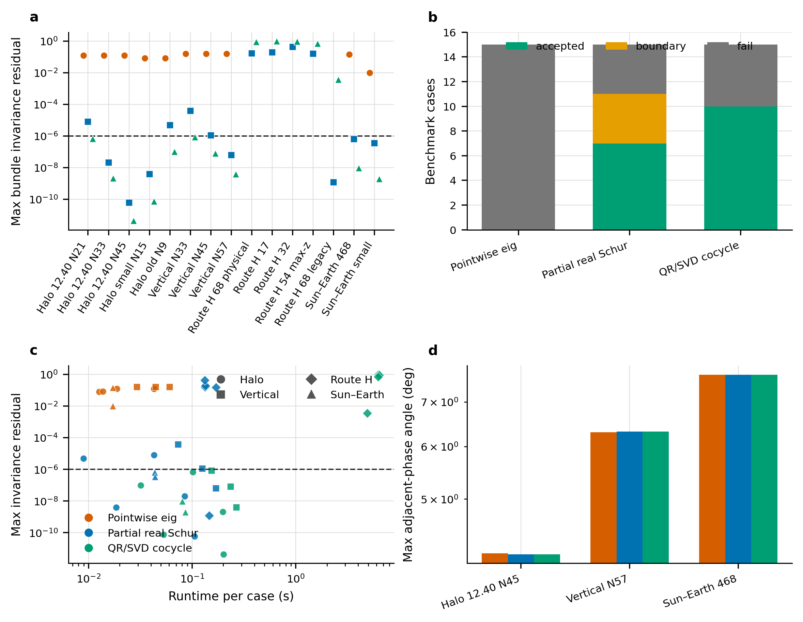
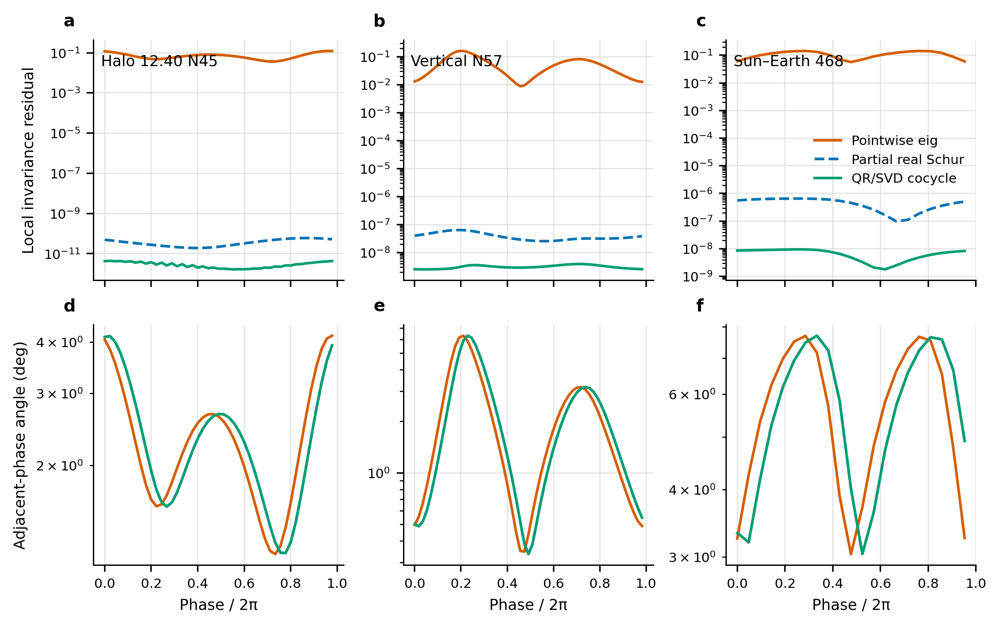
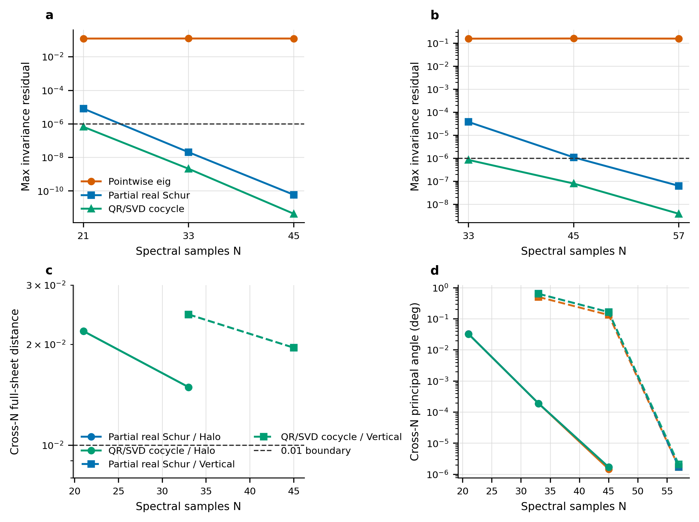
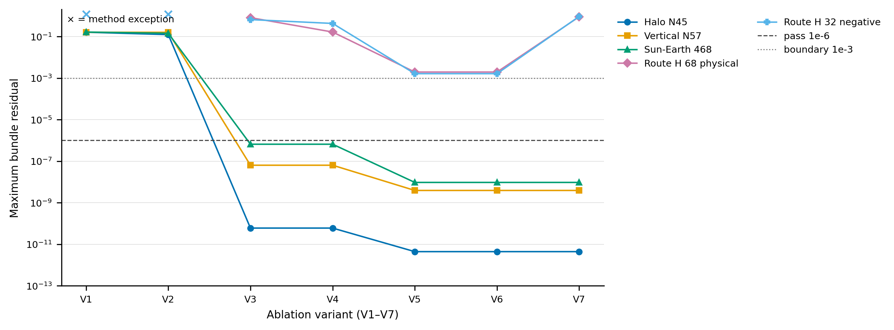
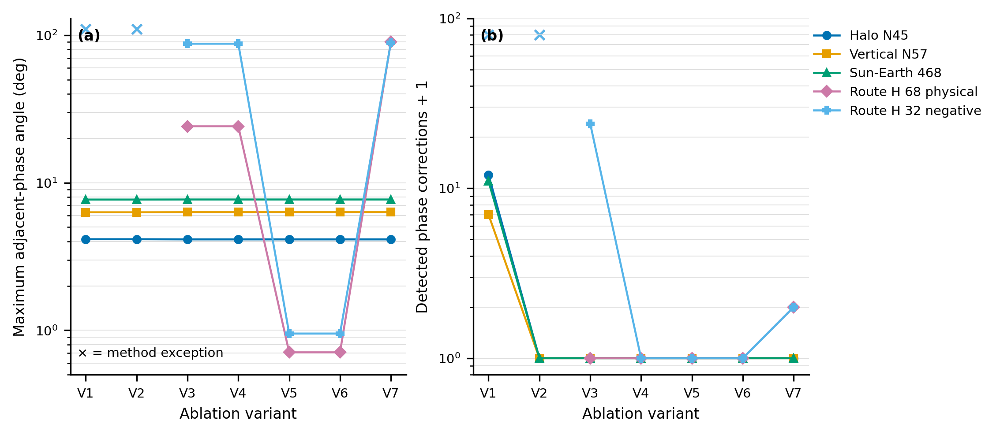
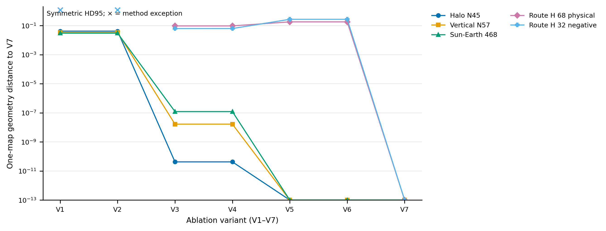
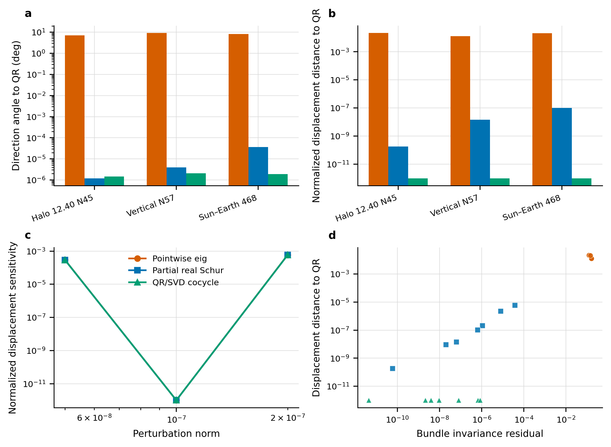
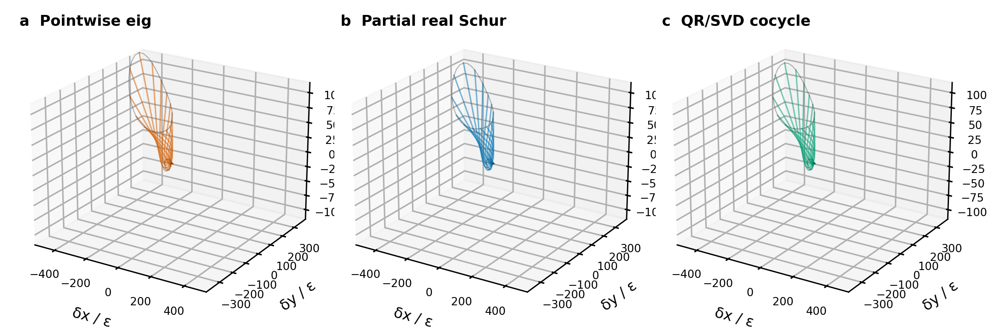
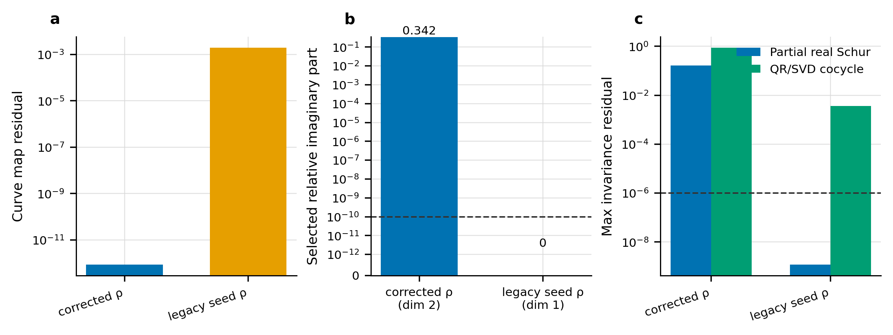

# 拟周期轨道实不变子束计算方法的数值比较、流形扩展与可靠性分析

- 作者：兀文昊
- 导师：张晨
- 单位：中国科学院大学
- 日期：2026年7月
- 稿件定位：数值框架、系统比较与有界扩展（`numerical_framework_systematic_comparison_and_bounded_extension`）
- 状态：`adviser_submission_decision_candidate`；可交导师决定是否进入选刊与投稿准备；尚未选刊，未获外部投稿授权

## 摘要

拟周期轨道附近的稳定与不稳定方向并非若干相位点上彼此独立的特征向量，而是由相位平移线性 cocycle 共同定义的实不变子束。若直接对每个局部状态转移矩阵做点式特征分解，容易出现方向符号跳变、复特征向量取实部后失去不变性、分辨率变化时方向不收敛，以及局部方向误差被放大为全局流形片几何误差。本文以冻结的 McCarthy 2018 复现工程为数据边界，构建 15 个案例、4 类轨道族、3 种方法的可审计 benchmark，对传统点式 eig、partial real-Schur 子空间选择和 shifted QR/SVD cocycle 迭代进行统一比较。

在固定阈值下，点式 eig 为 0/15 通过，partial real-Schur 为 7/15 通过、4/15 边界、4/15 失败，shifted QR/SVD 为 10/15 通过、5/15 失败。MATLAB R2024a 的独立 `schur/ordschur` 后端在 12 个关键案例上实现维数、分类和状态 12/12 一致，最大子空间主角为 2.561e-06°，低于 1e-4° 门槛。对 QR/SVD 的五个失败案例进行三种初始化、200/500/1000 次迭代、原生 N45 与 Fourier N67 诊断以及 80 位残差重算后，四个 physical corrected-rho Route H 案例仍是二维实共轭子空间上的一维失败；legacy seed-rho 案例仅在 Schur 初始化下通过，被分类为方法初始化敏感。

流形阶段保存 126 行全状态传播证据，其中 36 行通过、90 行失败；最大 Jacobi 漂移为 2.220e-15。高分辨率 Halo N45、Vertical N57 和 Sun–Earth 468 上，两种改进方法同时通过局部子束与测试范围内的流形门槛，但低分辨率全流形片到最高分辨率参考的距离仍超过 0.01。因此本文的可辩护贡献是一个带独立后端、失败分类、消融、全新进程重跑和 CI 守护的数值比较框架，而非全新理论。冻结的 Chapter 4 projection holdout 仍为 0/4，`paper_projection=fail`、`paper_3d=false`，本文不据此声称整篇学位论文等价复现或投稿就绪。

**关键词：** 拟周期轨道；不变子束；线性 cocycle；实 Schur 分解；QR/SVD；协变 Lyapunov 向量；CR3BP；不变流形；可重复性

## 1. 引言

拟周期运动是周期轨道与一般非周期运动之间的重要中间结构。在圆型限制性三体问题（CR3BP）中，周期轨道附近常存在双频或更高维拟周期环面，其内部相位演化可由旋转数表示，法向稳定性则决定扰动是收缩、扩张还是保持近中性。Olikara 与 Howell 的 Fourier/多重打靶计算以及 McCarthy 2018 的 stroboscopic mapping 工作构成了本研究的直接应用背景 [OlikaraHowell2010; Olikara2010Thesis; McCarthy2018]。后续工作进一步把拟周期环面及其流形用于四体模型与异宿连接 [McCarthyHowell2021; McCarthyHowell2023; OwenBaresi2024]。

数值困难集中在“方向”究竟是什么。对单个矩阵而言，特征向量满足局部代数方程；对拟周期环面而言，法向对象却必须同时满足相位平移和线性传播。Jorba 对不变曲线法向行为的计算、Haro 与 de la Llave 的参数化方法、Wysham 与 Meiss 的 cocycle 迭代以及 Huguet 等人的快速子束迭代均表明，目标是沿整条相位曲线耦合的对象 [Jorba2001; HaroLlave2006Numerical; WyshamMeiss2006; HuguetLlaveSire2013]。因此，“每个相位都找到一个很精确的局部特征向量”并不等价于“找到一个 cocycle 不变子束”。

本文从 54 图 McCarthy 复现工程中引出这一问题，但严格区分复现层和研究层。复现层已实现 54 个工程目标（13 个 V0、41 个 V2），证据等级仍为 7 个 accepted、30 个 boundary、5 个 diagnostic、12 个 proxy；这些标签被冻结。研究层只能读取其轨道、状态和元数据，不能把独立子束实验的成功回写为论文等价。尤其 Chapter 4 冻结 projection holdout 为 0/4，任何后验候选轨道或研究图都不得改变该结论。

依据 25 项核实的正式来源，partial real-Schur、连续正交化、QR/SVD 谱诊断、协变 Lyapunov 向量以及流形参数化都已有明确先例 [DieciRussellVanVleck1994; DieciVanVleck2002; GinelliEtAl2007; KuptsovParlitz2012; BaiDemmel1993; GranatKagstrom2006; HaroEtAl2016]。本文不使用“首次提出”或“全新理论”等措辞。贡献限定为：建立统一 benchmark；在相同源轨道和门槛下比较三类数值对象；用真正独立的 MATLAB Schur 后端复核；保留五个失败案例和七变体消融；把局部子束与全局流形片分开验收；通过全新进程重跑和 GitHub Actions 约束可重复性。

## 2. 问题描述与 cocycle 方程

设拟周期不变曲线由相位 θ∈T 参数化，离散映射使 θ 前进 ρ。沿曲线的线性化状态转移矩阵记为 A(θ)。秩为 k 的实子束由正交基 E(θ)∈R^(6×k) 表示，它必须满足

$$A(θ)E(θ) ≈ E(θ+ρ)R(θ),$$

其中 R(θ) 是子束内的约化映射；k=1 时为实标量，k=2 时为 2×2 实矩阵。本文采用归一化 Frobenius 残差

$$r(θ_i)=||A_iE_i-E_(i+ρ)(E_(i+ρ)^T A_iE_i)||_F / max(||A_iE_i||_F, ε_machine),$$

并同时报告最大/平均残差、相邻相位主角、跨分辨率主角、谱与倒数配对误差、复部相对量、运行时间、迭代次数和状态。通过阈值固定为 max r≤1e-6；1e-6<max r≤1e-3 仅可进入 boundary，若另有维数、源轨道或收敛失败则仍判 fail。

点式 eig 解的是 A(θ_i)v_i=λ_i v_i，而 cocycle 子束要求 A(θ_i)E_i 的像落入 θ_i+ρ 处的子空间。这两个方程只有在额外的可约化、分支一致和相位匹配条件成立时才可能一致。Eliasson 的几乎可约化理论也说明，可约化是需要条件的动力学性质，不能从每个相位都可对角化自动推出 [Eliasson2001]。这回答第一个科学问题：**pointwise eig 不是 cocycle invariant bundle，因为它没有约束相位平移后的像空间。**

第二个关键问题是实结构。若选中谱是一对 a±ib，任何单个复特征向量都不属于一维实空间；它的实部与虚部共同张成二维实不变子空间。Bai 与 Demmel 对实 Schur 1×1/2×2 块的重排以及 Granat 与 Kågström 对周期矩阵乘积 Schur 块的处理给出标准线性代数背景 [BaiDemmel1993; GranatKagstrom2006]。因此把复向量简单取实部会改变不变对象；**复共轭对不能被投影或重命名为一维实方向。**

## 3. 传统点式特征方向方法及其失效模式

基线方法在每个 θ_i 上独立分解 A_i，按模长选择稳定或不稳定分支；若得到复向量，则取实部、归一化，再做相邻符号对齐。这一实现不是为了制造弱基线，而是刻意保留工程中常见的捷径，以便区分局部特征对残差和全局 cocycle 残差。

15 个案例上，点式 eig 的研究状态全部为 fail。三个高分辨率锚点 Halo N45、Vertical N57、Sun–Earth 468 的最大 cocycle 残差分别为 1.240e-01、1.598e-01 和 1.434e-01。消融进一步显示，仅增加符号对齐可把 Halo N45 残差从 1.616e-1 降到 1.240e-1，却仍高于 1e-6 通过阈值约五个数量级；Vertical N57 与 Sun–Earth 468 也保持约 1e-1 量级。

这类失败并非“特征分解不够精确”。局部矩阵的特征对可以达到很小代数残差，但不同相位选出的向量没有保证属于同一全局分支；谱接近、符号翻转、复共轭对和网格插值都会造成跨相位不一致。协变 Lyapunov 向量文献进一步区分了正交 QR 向量、奇异向量和真正协变方向 [GinelliEtAl2007; KuptsovParlitz2012]。因此本文不把任一单步 QR 列或局部 SVD 右奇异向量直接称为物理不变方向。

## 4. Partial real-Schur 方法

第一种改进方法先构造谱配点算子 G_N=(P_(θ+ρ→θ)⊗I_6)diag(A_0,…,A_(N-1))，再选择目标实 Schur 块。若目标根在冻结容差内为实数，取 k=1；若为共轭复根，则以实部和虚部构造 k=2 的实基，绝不把二维块改写成一维。节点基经局部 QR 正交化与相位子空间对齐后，再回到点式 cocycle 方程计算科学残差。这里“partial”表示只提取并验证所选不变块，不意味着本文提出新的 Schur 理论。

内部 Python 路线在锁定的 SciPy 运行时不能直接调用完整 `scipy.linalg.schur`，因此使用有序目标特征对构造并验证实 partial-Schur 块。为消除同源实现的自证风险，阶段 2 把 12 个关键 G_N 算子导出给 MATLAB R2024a `schur/ordschur`。独立后端采用 Intel oneAPI MKL 2023.2；12/12 案例的块维数、分类与研究状态一致，最大主角 2.561e-06°，低于 1e-4° 门槛。该结果证明内部选中子空间与独立实 Schur 子空间在测试范围内一致，但不构成算法收敛定理。

在 15 案例中，partial real-Schur 得到 7 个 accepted、4 个 boundary、4 个 fail。三个锚点的最大残差依次为 5.999e-11、6.373e-08、6.543e-07。Route H physical corrected-rho 的四个案例则均由独立后端确认为 k=2 共轭块，并保持 fail。这说明 Schur 方法解决的是“实子空间维数与谱块选择”问题，不保证任意选中块都满足低残差的一维物理 bundle。

## 5. Shifted QR/SVD cocycle 迭代

第二种改进路线从局部右奇异子空间初始化，反复执行 A_iE_i 的传播、在 θ_i+ρ 网格上的 QR、插值回基准网格、再次 QR，并对当前帧与上一迭代/相邻相位做符号或 Procrustes 子空间对齐。停止条件是最大子空间更新角不超过 2e-6°，默认上限 200 次。Dieci、Russell 与 Van Vleck 的连续正交化以及 Dieci 与 Van Vleck 的 QR/SVD 谱计算提供了方法学背景 [DieciRussellVanVleck1994; DieciVanVleck2002]。

QR/SVD 在 15 案例中 10 个 accepted、5 个 fail，三个锚点残差分别为 4.403e-12、3.891e-09 和 9.472e-09。与 Schur 相比，它直接通过相位平移迭代逼近子空间，在若干一维案例上残差更低；但它对初始化、迭代上限和目标维数敏感，尤其不能自己把一个本质二维的共轭块变成一维实方向。

Schur 与 QR/SVD 解决的问题不同。Schur 路线负责稳定地识别实谱块、确定 k=1 还是 k=2，并为复杂谱提供可审计子空间；QR/SVD 路线负责在 cocycle 传播下迭代相位依赖帧，并提供收敛历史和 SVD 诊断。二者互为交叉检查而非简单替代。若 Schur 确认 k=2，而研究问题只接受一维分支，则正确结果是保留二维对象并报告一维失败，而不是强制降维。

## 6. Benchmark 轨道族与评价指标

注册表包含 15 个案例和四类轨道族：5 个地月 L1 拟 Halo、3 个地月 L1 拟 Vertical、4 个 Route H physical corrected-rho 加 1 个 legacy seed-rho 正控制，以及 2 个日地 L1 双频环面案例。谱网格从 N9 到 N57；Halo 与 Vertical 提供跨分辨率序列，Route H 提供算子语义与复谱压力测试，Sun–Earth 提供跨系统验证。所有案例均以状态文件哈希、映射时间、ρ、质量参数、积分器和源门槛登记，运行过程不得盲目延伸轨道族来追求更高通过率。

表 1 给出全部 15 案例的状态、实子空间维数 k 和最大不变性残差 r。accepted、boundary、fail 是研究层标签，不能写回冻结的 54 图复现等级。

| 案例 | N | Pointwise eig | Partial Schur | Shifted QR/SVD |
| --- | --- | --- | --- | --- |
| em_halo_12p40_n21 | 21 | 失败; k=1; r=1.235e-01 | 边界; k=1; r=8.122e-06 | 通过; k=1; r=6.687e-07 |
| em_halo_12p40_n33 | 33 | 失败; k=1; r=1.245e-01 | 通过; k=1; r=2.054e-08 | 通过; k=1; r=2.117e-09 |
| em_halo_12p40_n45 | 45 | 失败; k=1; r=1.240e-01 | 通过; k=1; r=5.999e-11 | 通过; k=1; r=4.403e-12 |
| em_halo_12p09_n15_small | 15 | 失败; k=1; r=8.248e-02 | 通过; k=1; r=3.936e-09 | 通过; k=1; r=7.518e-11 |
| em_halo_12p097_n9_lowres_negative | 9 | 失败; k=1; r=8.258e-02 | 边界; k=1; r=4.885e-06 | 通过; k=1; r=1.012e-07 |
| em_vertical_12p66_n33 | 33 | 失败; k=1; r=1.590e-01 | 边界; k=1; r=3.804e-05 | 通过; k=1; r=8.507e-07 |
| em_vertical_12p66_n45 | 45 | 失败; k=1; r=1.614e-01 | 边界; k=1; r=1.103e-06 | 通过; k=1; r=8.006e-08 |
| em_vertical_12p66_n57 | 57 | 失败; k=1; r=1.598e-01 | 通过; k=1; r=6.373e-08 | 通过; k=1; r=3.891e-09 |
| route_h_member_68 | 45 | 失败; k=0; r=nan | 失败; k=2; r=1.650e-01 | 失败; k=2; r=8.976e-01 |
| route_h_member_17 | 45 | 失败; k=0; r=nan | 失败; k=2; r=1.951e-01 | 失败; k=2; r=9.790e-01 |
| route_h_member_32 | 45 | 失败; k=0; r=nan | 失败; k=2; r=4.279e-01 | 失败; k=2; r=9.299e-01 |
| route_h_member_54 | 45 | 失败; k=0; r=nan | 失败; k=2; r=1.549e-01 | 失败; k=2; r=7.063e-01 |
| route_h_member_68_legacy_dg_positive | 45 | 失败; k=0; r=nan | 通过; k=1; r=1.203e-09 | 失败; k=1; r=3.646e-03 |
| se_active_geometry_member_468 | 21 | 失败; k=1; r=1.434e-01 | 通过; k=1; r=6.543e-07 | 通过; k=1; r=9.472e-09 |
| se_quasi_halo_small_n21 | 21 | 失败; k=1; r=9.908e-03 | 通过; k=1; r=3.479e-07 | 通过; k=1; r=1.952e-09 |

评价分为四层。第一层是源曲线/映射闭合；第二层是局部 bundle 的维数、残差、相位连续性和跨分辨率主角；第三层是传播后 Jacobi 漂移、线性增长一致性和相对 QR 的归一化位移距离；第四层是跨分辨率全流形片距离。只有前一层通过，后一层结果才有解释意义；但前一层通过并不自动使后一层通过。

## 7. 子束结果

总体结果首先否定了“局部特征方向足够好”的假设：Pointwise eig 0/15 accepted。partial real-Schur 与 shifted QR/SVD 在 Halo、Vertical 和 Sun–Earth 锚点上把残差从约 1e-1 降到 1e-7 至 1e-12 区间。两种改进方法在同一锚点的方向差约 4e-5°或更小，说明当一维实子束存在且数值可分离时，两条路线会收敛到一致几何对象。

表 2 汇总三个高分辨率案例的残差与运行时间。

| 案例 | Pointwise r_max | Schur r_max | QR/SVD r_max | Schur 秒 | QR/SVD 秒 |
| --- | --- | --- | --- | --- | --- |
| Halo N45 | 1.240e-01 | 5.999e-11 | 4.403e-12 | 0.106 | 0.201 |
| Vertical N57 | 1.598e-01 | 6.373e-08 | 3.891e-09 | 0.170 | 0.267 |
| Sun–Earth 468 | 1.434e-01 | 6.543e-07 | 9.472e-09 | 0.043 | 0.080 |

独立 MATLAB 后端的价值不在于再产生一张“看起来相同”的图，而在于验证实子空间分类。它对 Halo N21/N33/N45、Vertical N33/N45/N57、Sun–Earth 468、Route H 17/32/54/68 以及 legacy 68 共 12 案例给出 12/12 一致。特别地，四个 physical Route H 均为二维/失败，legacy 68 为一维/通过。这个结果阻止了用内部实现偏好解释 Route H 负结果。

全新进程重跑进一步从空 cocycle 缓存生成 15 个 cocycle、45 行 bundle 和 126 行 manifold 结果。与 Stage F 权威表逐字段比较 6156 项，其中 5301 项科学检查全部通过、855 项运行 ID/时间/哈希等来源字段保留为信息，失败为 0，科学数值最大相对差为 0.0。这验证实现稳定性，但不提升任何冻结复现标签。

## 8. 消融实验

消融覆盖 5 个案例×7 个变体，共 35 行：点式 eig 无相位对齐、仅符号对齐；Schur 无/有相位跟踪；QR/SVD 无/有相位对齐；以及 QR/SVD 使用 Schur 维数种子。总计 15 行 accepted、20 行 fail，并保留 4 个点式方法异常，异常不从分母中删除。

第一，点式符号对齐改善表面连续性但不能修复 cocycle 残差，说明符号跳变只是问题的一部分。第二，在三个一维锚点上，Schur 相位跟踪前后残差比约为 1，QR/SVD 相位对齐前后残差也约为 1；当子束已清晰分离时，相位对齐主要稳定表示而不是改变物理子空间。第三，在 Route H 2D 案例上，Schur 子空间相位跟踪可把 member 68 残差从 8.126e-1 降到 1.650e-1、member 32 从 6.537e-1 降到 4.279e-1，但仍是 fail。第四，给 QR/SVD 注入 Schur 维数能恢复“二维实对象”的语义，却没有把 Route H 变成可接受的一维 bundle。

最后一幅图的 `manifold_geometry_distance` 仅来自线性化一映射点云，是消融诊断，不等价于 Stage F 的非线性全状态流形片，也不能替代后者的 0.01 跨分辨率门槛。

## 9. 流形传播与几何收敛

Stage F 选择 7 个案例、3 种方法、3 个全状态扰动范数（5e-8、1e-7、2e-7）、正负两个方向和 41 个时间采样，形成 126 行结果。不同方法共享源状态、相位、传播时长、DOP853 容差、坐标系和停止规则。最大 Jacobi 漂移为 2.220e-15，初始线性增长比相对 1 的最大偏差为 1.127e-06。

Halo N45、Vertical N57、Sun–Earth 468 上，Schur 与 QR/SVD 在所有测试扰动和两个符号下均通过，合计 36 行 accepted。点式方法因上游 bundle 残差不合格而全部失败；Route H 物理案例也因目标一维 bundle 不成立而保持失败。三锚点上，点式方向相对 QR 相差约 7–9°，Schur 相对 QR 约 4e-5°以内；按扰动幅值归一化后，点式到 QR 的流形位移片距离约为 1e-2，而 Schur 到 QR 为 1e-7 或更小。

然而局部 bundle 收敛与全局 manifold sheet 收敛必须分开评价。Halo N21/N33 相对 N45 的全片距离约为 0.0219/0.0150，Vertical N33/N45 相对 N57 为 0.0245/0.0195，全部高于 0.01。局部主角可以已经很小，但有限时间传播、非线性曲率、初值离散和相位采样会积累成全片几何差异。因此本文只能说三个高分辨率锚点在测试传播窗内一致，不能说所有分辨率的全局流形已收敛。

## 10. Route H 算子语义案例

Route H 是本文最重要的负结果。legacy member 68 使用 seed-rho，选出近实一维正控制，但源曲线映射残差约 1.988e-3；physical corrected-rho 把映射闭合改进到约 8.697e-13，却显示目标谱为相对复部约 0.342 的共轭对。正确物理算子因此要求二维实子空间，而不是更“漂亮”的一维方向。映射闭合改善约九个数量级却失去一维通过，不是回退到旧 ρ 的理由，而是算子语义决定结果的证据。

对五个 QR/SVD 失败案例的有界分类如下。

| 案例 | 独立 Schur k | 最佳状态 | 最佳 r_max | 最终分类 |
| --- | --- | --- | --- | --- |
| route_h_member_17 | 2 | 失败 | 6.471e-01 | no_accepted_1d_bundle |
| route_h_member_32 | 2 | 失败 | 6.643e-01 | no_accepted_1d_bundle |
| route_h_member_54 | 2 | 失败 | 6.989e-01 | no_accepted_1d_bundle |
| route_h_member_68 | 2 | 失败 | 7.441e-01 | no_accepted_1d_bundle |
| route_h_member_68_legacy_dg_positive | 1 | 通过 | 2.223e-09 | method_initialization_sensitive |

member 17/32/54/68 的分支选择与独立 Schur 一致；三种初始化、三个迭代上限和 N67 Fourier lift 均未得到 accepted 一维 bundle，80 位 mpmath 只重算残差而没有伪装成任意精度轨迹积分。故其标签是 `no_accepted_1d_bundle`，而不是“算得不够久”。legacy 68 从 Schur seed 可通过、从 random/local-SVD 不稳定，被标为 `method_initialization_sensitive`。所有负结果原样进入 CSV、NPZ 和失败证据。

## 11. 计算成本

三个高分辨率锚点上，partial real-Schur 用时 0.106、0.170、0.043 秒，QR/SVD 用时 0.201、0.267、0.080 秒。二者在这些可接受案例上都远低于每案例 wall-time 上限。Pointwise eig 最快，但其 0/15 accepted 使单纯速度比较没有科学意义。

Route H 的失败 QR 运行会达到 200 次迭代上限并耗时数秒；失败分类又扩展到 500/1000 次、三种初始化和 N67 诊断。因此成本必须与状态共同报告。把失败行从运行时间统计中删除，会系统性低估鲁棒算法在困难谱结构上的真实代价。

实现使用 `D:\miniconda3\envs\cislunar\python.exe`、Python 3.11、NumPy/OpenBLAS 和 SciPy；独立 Schur 使用 MATLAB R2024a 24.1.0.2537033 与 Intel oneAPI MKL 2023.2。全新进程重跑记录控制器和工作进程 PID、命令、缓存语义、环境、CSV/NPZ 哈希。GitHub Actions 快速 CI 在 push/PR 上运行导入、单元测试、注册表、小型物理 benchmark、文档一致性和权威哈希守护；完整研究验证由手动 workflow_dispatch 触发并把输出写到 runner 临时目录。

## 12. Stage H：稳定子束、二维流形与长传播扩展

旧稿明确列出的四项实证缺口已按预注册上限执行；这里的“完成”是指案例、配置、失败和边界均已留下可复核证据，不等于所有数值行均 accepted。Stage H 的注册表、配置、锁、CSV、NPZ、Markdown、环境记录和 SHA256 均位于 `research/invariant_bundles/submission_candidate/`。研究结果不写回复现权威表。

| 子阶段 | 预注册范围 | 观测结果 | Gate |
|---|---|---|---|
| H2 稳定子束 | 3 案例 × 3 方法 | 9 行；改进方法 accepted=6，点式方法 fail=3 | `pass` |
| H2 稳定流形 | 3 案例 × 3 方法 × 3 扰动 × 2 符号 | 54 行；改进方法 accepted=36，失败行保留 | `pass` |
| H3 Route H 二维对象 | 2 案例、8 个角向种子 | 90 相位诊断、8 流形行；Schur accepted=4 | `pass` |
| H4 三周期传播 | 3 案例 × 2 方法 × 2 符号 | 12 结果行：accepted=8、物理边界=4；轨迹事件=492 | `pass` |
| H5 Sun–Earth 扩展 | 3 个不同本地源 × 3 方法 | 9 benchmark 行；改进方法 boundary=6、点式 fail=3 | `pass` |

### 12.1 三个稳定子束与稳定流形 benchmark

Halo N45、Vertical N57 与 Sun–Earth member 468 均按稳定分支、反向传播重新验收。两种改进方法在三个案例上形成 6 行 accepted 稳定一维子束；点式 eig 的 3 行最大不变性残差仍约为 1e-1，并保留为 fail。随后 54 行稳定流形传播覆盖三种扰动幅值和两个符号；改进方法 36 行通过，点式方法 18 行因上游 bundle 失败而保留。由此可以把旧稿只验证“不稳定一维分支”的限制收窄为：稳定分支已在三个代表案例、一个映射周期和声明扰动范围内通过；这仍不是全轨道族或高保真星历验证。

### 12.2 Route H 二维实子空间流形

member 68 与 member 32 的物理 corrected-rho 算子仍是实二维共轭块，绝不重命名为一维方向。原始方程残差最大为 `5.678e-14`，gauge-consistent 子空间残差最大为 `2.152e-12`。在 real-Schur 实化后，两案例各产生 2 个扰动幅值对应的 accepted 二维流形对象，共 4 行；所有对象保持初始片秩 2。冻结 Stage E 的归一化帧残差和一维 fail 状态同时保留，说明 H3 解决的是表示与二维几何对象，而不是事后改写旧的一维验收。

QR/SVD 路线按 local-SVD、Schur seed 和确定性随机 seed 三种初始化，每种至 500 次迭代；两案例均留下有界失败证据，没有生成可接受对象，也没有降为一维。这一结果支持“Schur 二维对象在当前实现中可构造”，不支持“所有二维迭代算法均已收敛”。

### 12.3 三周期传播与物理半径边界

H4 对三个稳定分支固定传播 3 个映射周期，局部、全局与远场阈值只记录首次越界时刻，不终止积分。12 个方法/符号结果中 8 行 accepted、4 行 boundary；每个案例至少有一行无物理碰撞的 accepted 结果。4 个接近次天体的初始尝试触发且仅触发一次收紧积分重试，最终选中轨迹最大 Jacobi 漂移为 `7.918e-11`。Halo 正号和 Vertical 负号的两种方法进入采样月球物理半径，故保留为物理 boundary，而不是删除或误报为数值失败。

### 12.4 三个新增 Sun–Earth 本地源 benchmark

H5 使用 active-event-step、sharpness-stage-4 与 energy-frontier 三个不同本地状态文件/数组，它们均不在冻结 Stage-C 注册表中。三源重算映射残差依次为 8.264e-09, 9.583e-09, 1.885e-09，均通过各自源上限。Schur/QR 的 6 行改进结果约为 4.3e-5 至 4.8e-5，依冻结研究阈值只能标为 boundary；点式方法 3 行 fail。对应 18 行一周期流形中，改进方法 12 行 boundary、点式 6 行诊断性 fail。

“新增独立源”仅表示三套不同的本地源工件、状态数组和元数据指纹；不表示外部独立求解器、独立机构数据或第三方实验验证。所有 H5 行都携带 `source_authority_boundary=true`，因此不能被摘要压缩成“3 个 Sun–Earth 案例通过”。

## 13. 局限性与讨论

第一，本文不是整篇 McCarthy 2018 的严格数值等价复现。54 图工程覆盖和 25 项外部文献核实只是研究起点；Chapter 4 projection holdout 仍为 0/4，`paper_projection=fail`、`paper_3d=false`。后验 12.397983 日 N21 候选只能作为根因线索，不能替换冻结 holdout。

第二，本文没有给出子束存在、唯一性、可约化性或收敛率的新证明。Haro 与 de la Llave 的严格结果所需假设和 a-posteriori 估计超出本研究 [HaroLlave2006Rigorous]。MATLAB 独立后端验证了 12 个有限离散算子的实 Schur 子空间一致性，不等于连续问题定理，也不是第三个库/硬件后端的交叉验证。

第三，QR/SVD 失败分类是有界搜索。迭代上限为 1000，诊断分辨率至 N67；80 位计算只重算残差，没有用任意精度重积分 CR3BP 轨迹。因而 `no_accepted_1d_bundle` 的精确含义是“在声明的配置空间内未发现通过的一维 bundle”，而不是对所有算法和所有分辨率的不可能性证明。

第四，Stage H 已增加三个稳定子束及其稳定流形、两个 Route H 二维实子空间流形、三个三周期传播案例和三个不同本地 Sun–Earth 源。其有效范围仍受预注册案例、CR3BP 会合坐标、固定三周期、有限扰动和本地源权威边界限制；尚未覆盖高保真星历、外部独立求解器、全轨道族统计或更长任务级传播。局部 bundle 残差与全局流形片几何仍是不同验收对象，不能互相代替。

第五，文献矩阵覆盖九个指定主题和 25 项正式来源，但不是系统综述或穷尽性 novelty search。21 个 DOI 已核实，四个学位/会议来源明确记录为未分配 DOI；页面访问受 robots 或付费墙限制时使用出版社元数据、DOI 注册和机构库交叉核验。因此当前定位只能是“数值框架与系统比较”，不应升级为方法首创。

最后，Stage H 补齐了旧稿点名的四类计算证据，但独立后端、失败分类、消融、全新进程和 CI 仍不会自动满足具体期刊的理论深度、统计广度、外部验证或格式要求。本包的精确状态是 **可交导师作投稿决策**，不是“已经达到投稿条件”，更不是已经获得外部投稿授权。

## 14. 结论

本文回答了七个核心科学问题。其一，pointwise eig 只满足局部代数方程，不满足相位平移 cocycle 方程，故不是自动成立的不变子束。其二，复共轭对在实数域对应二维 Schur 子空间，不能投影为一维实方向。其三，Schur 解决实谱块分类和维数语义，QR/SVD 解决相位传播下的子空间迭代与收敛诊断。其四，在 Halo N45、Vertical N57、Sun–Earth 468 等案例上两种改进方法有效，并在独立 MATLAB 后端与全新进程重跑中复核。其五，physical Route H 四案和低分辨率全片收敛仍失败，失败未被隐藏。

其六，失败来源需要分层：点式方法主要是方程语义错误；Route H 一维失败主要受真实二维复谱结构约束，并伴随部分源状态边界；legacy 68 还存在初始化敏感；低分辨率流形片差异则是全局几何/分辨率问题。其七，局部 bundle 收敛只控制切空间种子，非线性传播会积累曲率与采样误差，因此全局 manifold sheet 必须使用独立几何门槛。

在冻结阈值下，partial real-Schur 和 shifted QR/SVD 相对 pointwise eig 显著降低了可接受案例的 cocycle 残差，同时把二维共轭子空间、初始化敏感、物理半径穿越与 Sun–Earth 源权威边界明确暴露出来。Stage H 已按预注册补充稳定子束、二维 Route H 流形、三周期传播和三个新增本地 Sun–Earth 源；最稳妥的论文定位因此更新为 `numerical_framework_systematic_comparison_and_bounded_extension`。下一步不是继续无边界扩算，而是由导师决定目标期刊、理论深化程度、是否要求外部求解器复核，以及哪些 boundary 结果进入正文。

<!-- PAGEBREAK -->

## 参考文献

1. Brian P. McCarthy. Characterization of Quasi-Periodic Orbits for Applications in the Sun-Earth and Earth-Moon Systems. Purdue University M.S. thesis, 2018. DOI：未分配。 https://docs.lib.purdue.edu/dissertations/AAI30502018/

2. Zubin P. Olikara; Kathleen C. Howell. Computation of Quasi-Periodic Invariant Tori in the Restricted Three-Body Problem. 20th AAS/AIAA Space Flight Mechanics Meeting, AAS 10-120, 2010. DOI：未分配。 https://engineering.purdue.edu/people/kathleen.howell.1/Publications/Conferences/2010_AAS_OliHow.pdf

3. Zubin P. Olikara. Computation of Quasi-Periodic Tori in the Circular Restricted Three-Body Problem. Purdue University M.S. thesis, 2010. DOI：未分配。 https://engineering.purdue.edu/people/kathleen.howell.1/Publications/Masters/2010_Olikara.pdf

4. Àngel Jorba; Josep Masdemont. Dynamics in the Center Manifold of the Collinear Points of the Restricted Three Body Problem. Physica D: Nonlinear Phenomena, 1999. DOI: 10.1016/S0167-2789(99)00042-1. https://www.sciencedirect.com/science/article/pii/S0167278999000421

5. Àngel Jorba. Numerical Computation of the Normal Behaviour of Invariant Curves of n-Dimensional Maps. Nonlinearity, 2001. DOI: 10.1088/0951-7715/14/5/303. https://doi.org/10.1088/0951-7715/14/5/303

6. Àlex Haro; Rafael de la Llave. A Parameterization Method for the Computation of Invariant Tori and Their Whiskers in Quasi-Periodic Maps: Numerical Algorithms. Discrete and Continuous Dynamical Systems - B, 2006. DOI: 10.3934/dcdsb.2006.6.1261. https://www.aimsciences.org/article/doi/10.3934/dcdsb.2006.6.1261

7. Àlex Haro; Rafael de la Llave. A Parameterization Method for the Computation of Invariant Tori and Their Whiskers in Quasi-Periodic Maps: Rigorous Results. Journal of Differential Equations, 2006. DOI: 10.1016/j.jde.2005.10.005. https://www.sciencedirect.com/science/article/pii/S0022039605003487

8. Àlex Haro; Rafael de la Llave. A Parameterization Method for the Computation of Invariant Tori and Their Whiskers in Quasi-Periodic Maps: Explorations and Mechanisms for the Breakdown of Hyperbolicity. SIAM Journal on Applied Dynamical Systems, 2007. DOI: 10.1137/050637327. https://epubs.siam.org/doi/10.1137/050637327

9. Àlex Haro; Marta Canadell; Jordi-Lluis Figueras; Alejandro Luque; Josep Maria Mondelo. The Parameterization Method for Invariant Manifolds: From Rigorous Results to Effective Computations. Springer Applied Mathematical Sciences, volume 195, 2016. DOI: 10.1007/978-3-319-29662-3. https://link.springer.com/book/10.1007/978-3-319-29662-3

10. Derin B. Wysham; James D. Meiss. Iterative Techniques for Computing the Linearized Manifolds of Quasiperiodic Tori. Chaos: An Interdisciplinary Journal of Nonlinear Science, 2006. DOI: 10.1063/1.2200159. https://doi.org/10.1063/1.2200159

11. Gemma Huguet; Rafael de la Llave; Yannick Sire. Fast Iteration of Cocycles over Rotations and Computation of Hyperbolic Bundles. AIMS Proceedings, 2013. DOI: 10.3934/proc.2013.2013.323. https://www.aimsciences.org/article/doi/10.3934/proc.2013.2013.323

12. Lars H. Eliasson. Almost Reducibility of Linear Quasi-Periodic Systems. Smooth Ergodic Theory and Its Applications, Proceedings of Symposia in Pure Mathematics 69, 2001. DOI: 10.1090/pspum/069/1858550. https://doi.org/10.1090/pspum/069/1858550

13. Luca Dieci; Robert D. Russell; Erik S. Van Vleck. Unitary Integrators and Applications to Continuous Orthonormalization Techniques. SIAM Journal on Numerical Analysis, 1994. DOI: 10.1137/0731014. https://epubs.siam.org/doi/10.1137/0731014

14. Luca Dieci; Erik S. Van Vleck. Lyapunov Spectral Intervals: Theory and Computation. SIAM Journal on Numerical Analysis, 2002. DOI: 10.1137/S0036142901392304. https://epubs.siam.org/doi/10.1137/S0036142901392304

15. Francesco Ginelli; Paolo Poggi; Antonio Turchi; Hugues Chaté; Roberto Livi; Antonio Politi. Characterizing Dynamics with Covariant Lyapunov Vectors. Physical Review Letters, 2007. DOI: 10.1103/PhysRevLett.99.130601. https://journals.aps.org/prl/abstract/10.1103/PhysRevLett.99.130601

16. Pavel V. Kuptsov; Ulrich Parlitz. Theory and Computation of Covariant Lyapunov Vectors. Journal of Nonlinear Science, 2012. DOI: 10.1007/s00332-012-9126-5. https://link.springer.com/article/10.1007/s00332-012-9126-5

17. Zhaojun Bai; James W. Demmel. On Swapping Diagonal Blocks in Real Schur Form. Linear Algebra and its Applications, 1993. DOI: 10.1016/0024-3795(93)90286-W. https://www.sciencedirect.com/science/article/pii/002437959390286W

18. Robert Granat; Bo Kågström. Direct Eigenvalue Reordering in a Product of Matrices in Periodic Schur Form. SIAM Journal on Matrix Analysis and Applications, 2006. DOI: 10.1137/05062490X. https://epubs.siam.org/doi/10.1137/05062490X

19. Bernd Krauskopf; Hinke M. Osinga; Eusebius J. Doedel; Michael E. Henderson; John Guckenheimer; Alexander Vladimirsky; Michael Dellnitz; Oliver Junge. A Survey of Methods for Computing (Un)Stable Manifolds of Vector Fields. International Journal of Bifurcation and Chaos, 2005. DOI: 10.1142/S0218127405012533. https://doi.org/10.1142/S0218127405012533

20. Wang Sang Koon; Martin W. Lo; Jerrold E. Marsden; Shane D. Ross. Heteroclinic Connections Between Periodic Orbits and Resonance Transitions in Celestial Mechanics. Chaos: An Interdisciplinary Journal of Nonlinear Science, 2000. DOI: 10.1063/1.166509. https://authors.library.caltech.edu/records/655vt-rs378

21. Gerard Gómez; Wang Sang Koon; Martin W. Lo; Jerrold E. Marsden; Josep Masdemont; Shane D. Ross. Connecting Orbits and Invariant Manifolds in the Spatial Restricted Three-Body Problem. Nonlinearity, 2004. DOI: 10.1088/0951-7715/17/5/002. https://doi.org/10.1088/0951-7715/17/5/002

22. Davide Guzzetti; Natasha Bosanac; Amanda Haapala; Kathleen C. Howell; David C. Folta. Rapid Trajectory Design in the Earth-Moon Ephemeris System via an Interactive Catalog of Periodic and Quasi-Periodic Orbits. Acta Astronautica, 2016. DOI: 10.1016/j.actaastro.2016.06.029. https://www.sciencedirect.com/science/article/pii/S0094576516301448

23. Brian P. McCarthy; Kathleen C. Howell. Quasi-Periodic Orbits in the Sun-Earth-Moon Bicircular Restricted Four-Body Problem. AAS/AIAA Space Flight Mechanics Meeting, AAS 21-270, 2021. DOI：未分配。 https://engineering.purdue.edu/people/kathleen.howell.1/Publications/Conferences/2021_AAS_McCHow.pdf

24. Brian McCarthy; Kathleen Howell. Construction of Heteroclinic Connections Between Quasi-Periodic Orbits in the Three-Body Problem. The Journal of the Astronautical Sciences, 2023. DOI: 10.1007/s40295-023-00389-5. https://link.springer.com/article/10.1007/s40295-023-00389-5

25. Danny Owen; Nicola Baresi. Applications of Knot Theory to the Detection of Heteroclinic Connections Between Quasi-Periodic Orbits. Astrodynamics, 2024. DOI: 10.1007/s42064-024-0201-0. https://link.springer.com/article/10.1007/s42064-024-0201-0
